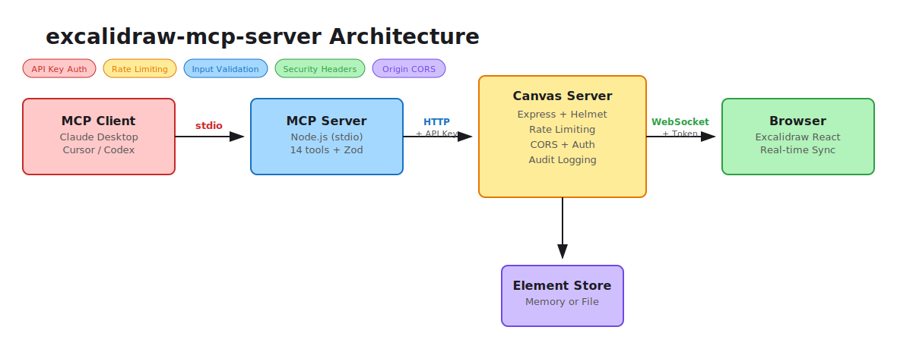

# excalidraw-mcp-server

Security-hardened MCP server for Excalidraw with API key auth, rate limiting, and real-time canvas sync.

[](https://github.com/debu-sinha/excalidraw-mcp-server/actions/workflows/ci.yml)
[](https://www.npmjs.com/package/excalidraw-mcp-server)
[](LICENSE)
[](https://nodejs.org/)

## Why this exists

Existing Excalidraw MCP servers ship with no authentication, wildcard CORS, no rate limiting, and unbounded inputs. That is fine for a quick demo but not acceptable for any real use. This project is a ground-up rewrite with security as a first-class requirement -- not a patch on top of an insecure foundation.

## Features

- **API key authentication** on all endpoints with constant-time comparison
- **Origin-restricted CORS** -- no wildcards, explicit allowlist
- **WebSocket auth** -- token validation and origin checks on every connection
- **Rate limiting** -- standard tier for reads, strict tier for mutations
- **Input validation** -- bounded Zod schemas with `.strict()` on every endpoint
- **Security headers** -- Helmet.js with CSP, HSTS, X-Frame-Options
- **14 MCP tools** -- create, update, delete, query, batch, group, align, distribute, export, and more
- **Real-time sync** -- WebSocket broadcast keeps all connected clients in sync
- **File persistence** -- optional atomic-write file store for durable state
- **Structured logging** -- pino-based audit trail for all operations
- **Mermaid support** -- convert Mermaid diagrams to Excalidraw elements

## Install

```bash
npm install -g excalidraw-mcp-server
```

Or run directly with npx:

```bash
npx excalidraw-mcp-server
```

## Quick start

```bash
# Option 1: Install from npm
npm install -g excalidraw-mcp-server

# Option 2: Clone and build from source
git clone https://github.com/debu-sinha/excalidraw-mcp-server.git
cd excalidraw-mcp-server
npm ci
npm run build

# Generate an API key
node scripts/generate-api-key.cjs
# Copy the output -- you will need it below

# Start the canvas server (in one terminal)
EXCALIDRAW_API_KEY=<your-key> npm run canvas

# The MCP server is started by your MCP client (see configuration below)
```

Open `http://localhost:3000` in a browser to see the Excalidraw canvas. The frontend connects via WebSocket and receives real-time updates as the MCP client creates and modifies elements.

## Architecture

<p align="center">
  
</p>

The MCP server communicates with clients over stdio (standard MCP transport). It forwards tool calls to the canvas server over authenticated HTTP. The canvas server manages element state and broadcasts changes to connected browser clients over authenticated WebSocket. Every hop is authenticated and rate-limited.

## Security comparison

| Feature | Typical MCP servers | excalidraw-mcp-server |
|---------|--------------------|-----------------------|
| Authentication | None | API key (constant-time compare) |
| CORS | `*` wildcard | Origin allowlist |
| WebSocket auth | None | Token + origin validation |
| Rate limiting | None | Standard + strict tiers |
| Input validation | Minimal | Bounded Zod with `.strict()` |
| Security headers | None | Helmet.js + CSP |
| Request size limit | None | 512KB body, 1MB WebSocket |
| Audit logging | None | Structured pino logs |

## Configuration

All settings are controlled via environment variables. Copy `.env.example` to `.env` and adjust as needed.

| Variable | Default | Description |
|----------|---------|-------------|
| `CANVAS_HOST` | `127.0.0.1` | Canvas server bind address |
| `CANVAS_PORT` | `3000` | Canvas server port |
| `EXCALIDRAW_API_KEY` | Auto-generated | API key for auth (min 32 chars) |
| `CORS_ALLOWED_ORIGINS` | `http://localhost:3000,http://127.0.0.1:3000` | Comma-separated origin allowlist |
| `RATE_LIMIT_WINDOW_MS` | `60000` | Rate limit window in milliseconds |
| `RATE_LIMIT_MAX_REQUESTS` | `100` | Max requests per window (standard tier) |
| `PERSISTENCE_ENABLED` | `false` | Enable file-based persistence |
| `PERSISTENCE_DIR` | `./data` | Directory for persistent storage |
| `CANVAS_SERVER_URL` | `http://127.0.0.1:3000` | URL the MCP server uses to reach the canvas |
| `LOG_LEVEL` | `info` | Log level: debug, info, warn, error |
| `AUDIT_LOG_ENABLED` | `true` | Enable audit logging |
| `MAX_ELEMENTS` | `10000` | Maximum elements on canvas |
| `MAX_BATCH_SIZE` | `100` | Maximum elements per batch create |

## MCP tools

| Tool | Description |
|------|-------------|
| `create_element` | Create a single element (rectangle, ellipse, diamond, arrow, text, line, freedraw) |
| `update_element` | Update an existing element by ID |
| `delete_element` | Delete an element by ID |
| `query_elements` | Search elements by type, locked status, or group ID |
| `get_resource` | Get scene state, all elements, theme, or library |
| `batch_create_elements` | Create up to 100 elements in one call |
| `group_elements` | Group multiple elements together |
| `ungroup_elements` | Remove elements from a group |
| `align_elements` | Align elements (left, center, right, top, middle, bottom) |
| `distribute_elements` | Distribute elements evenly (horizontal or vertical) |
| `lock_elements` | Lock elements to prevent modification |
| `unlock_elements` | Unlock elements |
| `create_from_mermaid` | Convert a Mermaid diagram to Excalidraw elements |
| `export_scene` | Export the canvas as PNG or SVG |

## MCP client configuration

### Claude Desktop

Add to `claude_desktop_config.json`:

```json
{
  "mcpServers": {
    "excalidraw": {
      "command": "npx",
      "args": ["excalidraw-mcp-server"],
      "env": {
        "EXCALIDRAW_API_KEY": "<your-api-key>",
        "CANVAS_SERVER_URL": "http://127.0.0.1:3000"
      }
    }
  }
}
```

### Cursor

Add to `.cursor/mcp.json` in your project root:

```json
{
  "mcpServers": {
    "excalidraw": {
      "command": "npx",
      "args": ["excalidraw-mcp-server"],
      "env": {
        "EXCALIDRAW_API_KEY": "<your-api-key>",
        "CANVAS_SERVER_URL": "http://127.0.0.1:3000"
      }
    }
  }
}
```

### Codex CLI

Add to your Codex MCP configuration:

```json
{
  "mcpServers": {
    "excalidraw": {
      "command": "npx",
      "args": ["excalidraw-mcp-server"],
      "env": {
        "EXCALIDRAW_API_KEY": "<your-api-key>",
        "CANVAS_SERVER_URL": "http://127.0.0.1:3000"
      }
    }
  }
}
```

Replace `<your-api-key>` with the key generated earlier. If you prefer to run from a local clone instead of npx, replace the command with `"node"` and args with `["<path-to>/excalidraw-mcp-server/dist/mcp/index.js"]`.

## Development

```bash
# Install dependencies
npm ci

# Run in development mode (watch + Vite dev server)
npm run dev

# Run tests
npm test

# Run tests with coverage
npm run test:coverage

# Lint
npm run lint

# Type check
npm run type-check

# Build
npm run build
```

## Project structure

```
src/
  mcp/              MCP server (stdio transport)
    tools/          14 tool implementations
    schemas/        Zod schemas and input limits
    canvas-client.ts  HTTP client for canvas server
    index.ts        MCP server entry point
  canvas/           Canvas server (Express + WebSocket)
    middleware/      Auth, CORS, rate limiting, audit, security headers
    routes/         REST API routes
    ws/             WebSocket handler and protocol
    store/          Element storage (memory + file)
    index.ts        Canvas server entry point
  shared/           Shared config, types, logging
frontend/           Excalidraw React frontend
test/               Unit and integration tests
```

## License

[MIT](LICENSE)
