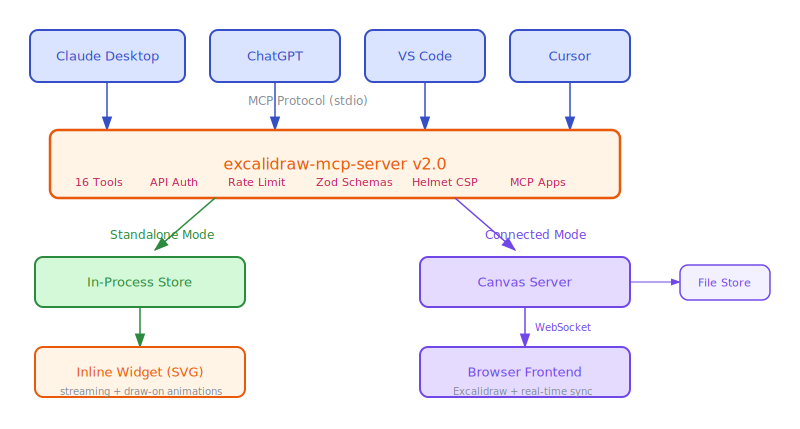

# excalidraw-mcp-server

The only Excalidraw MCP server with security hardening, inline diagram rendering, and real-time canvas sync.

[](https://github.com/debu-sinha/excalidraw-mcp-server/actions/workflows/ci.yml)
[](https://www.npmjs.com/package/excalidraw-mcp-server)
[](https://www.npmjs.com/package/excalidraw-mcp-server)
[](LICENSE)
[](https://nodejs.org/)

<p align="center">
  
</p>

## What it does

Ask your AI to draw a diagram, and it appears right inside the chat. The MCP server gives Claude Desktop, ChatGPT, VS Code, and Cursor a full set of drawing tools backed by the Excalidraw format -- with API authentication, rate limiting, and input validation on every operation.

v2.0 adds **MCP Apps support**: diagrams stream inline as interactive SVG widgets with draw-on animations, and you can export any diagram to excalidraw.com with one click.

## Two modes, zero config

**Standalone mode** (default) -- just install and go. The server runs with an in-process element store. No canvas server, no API keys, no setup. Your MCP client calls the tools, and diagrams render inline.

**Connected mode** -- start the optional canvas server for real-time browser sync. Multiple clients can collaborate on the same canvas through authenticated WebSocket connections. File persistence keeps state across restarts.

The server auto-detects which mode to use: if a canvas server is reachable, it connects to it. Otherwise it falls back to standalone.

## Architecture

<p align="center">
  
</p>

*Diagram created with excalidraw-mcp-server -- [edit in Excalidraw](docs/architecture-v2.excalidraw.json)*

## Features

**MCP Apps (v2.0)**
- Inline diagram rendering in Claude Desktop, ChatGPT, and VS Code
- Streaming SVG with draw-on animations as elements arrive
- Export to excalidraw.com with one click
- Element reference cheatsheet via `read_me` tool

**16 MCP tools**
- Create, update, delete, and query elements (rectangle, ellipse, diamond, arrow, text, line, freedraw)
- Batch create up to 100 elements at once
- Group, ungroup, align, distribute, lock, unlock
- Mermaid diagram conversion
- SVG and PNG export

**Security**
- API key authentication with constant-time comparison
- Origin-restricted CORS (no wildcards)
- WebSocket auth with token and origin validation
- Standard and strict rate limiting tiers
- Bounded Zod schemas with `.strict()` on every endpoint
- Helmet.js security headers with CSP

**Infrastructure**
- Real-time WebSocket sync across browser clients
- Optional atomic-write file persistence
- Structured pino audit logging

## Install

```bash
npm install -g excalidraw-mcp-server
```

Or run directly:

```bash
npx excalidraw-mcp-server
```

## Quick start

### Standalone (recommended for most users)

Just point your MCP client at the server. No canvas server needed.

```json
{
  "mcpServers": {
    "excalidraw": {
      "command": "npx",
      "args": ["excalidraw-mcp-server"]
    }
  }
}
```

Then ask your AI: *"Draw an architecture diagram showing a load balancer, three app servers, and a database"*

### Connected mode (real-time browser sync)

```bash
# Generate an API key
node scripts/generate-api-key.cjs

# Start the canvas server
EXCALIDRAW_API_KEY=<your-key> npm run canvas

# Open http://localhost:3000 to see the live canvas
```

Point your MCP client at the server with the same API key:

```json
{
  "mcpServers": {
    "excalidraw": {
      "command": "npx",
      "args": ["excalidraw-mcp-server"],
      "env": {
        "EXCALIDRAW_API_KEY": "<your-key>",
        "CANVAS_SERVER_URL": "http://127.0.0.1:3000"
      }
    }
  }
}
```

## MCP tools

| Tool | Description |
|------|-------------|
| `create_view` | Render elements as an inline SVG widget with streaming animations (MCP Apps) |
| `read_me` | Get the element reference cheatsheet (types, colors, sizing tips) |
| `create_element` | Create a single element (rectangle, ellipse, diamond, arrow, text, line, freedraw) |
| `update_element` | Update an existing element by ID |
| `delete_element` | Delete an element by ID |
| `query_elements` | Search elements by type, locked status, or group ID |
| `get_resource` | Get scene state, all elements, theme, or library |
| `batch_create_elements` | Create up to 100 elements in one call |
| `group_elements` | Group multiple elements together |
| `ungroup_elements` | Remove elements from a group |
| `align_elements` | Align elements (left, center, right, top, middle, bottom) |
| `distribute_elements` | Distribute elements evenly (horizontal or vertical) |
| `lock_elements` | Lock elements to prevent modification |
| `unlock_elements` | Unlock elements |
| `create_from_mermaid` | Convert a Mermaid diagram to Excalidraw elements |
| `export_scene` | Export the canvas as SVG or PNG |

## Security comparison

| Feature | Typical MCP servers | excalidraw-mcp-server |
|---------|--------------------|-----------------------|
| Authentication | None | API key (constant-time compare) |
| CORS | `*` wildcard | Origin allowlist |
| WebSocket auth | None | Token + origin validation |
| Rate limiting | None | Standard + strict tiers |
| Input validation | Minimal | Bounded Zod with `.strict()` |
| Security headers | None | Helmet.js + CSP |
| Request size limit | None | 512KB body, 1MB WebSocket |
| Audit logging | None | Structured pino logs |

## Configuration

All settings via environment variables. Copy `.env.example` to `.env` and adjust as needed.

| Variable | Default | Description |
|----------|---------|-------------|
| `STANDALONE_MODE` | `true` | Use in-process store (no canvas server needed) |
| `CANVAS_HOST` | `127.0.0.1` | Canvas server bind address |
| `CANVAS_PORT` | `3000` | Canvas server port |
| `EXCALIDRAW_API_KEY` | Auto-generated | API key for auth (min 32 chars) |
| `CORS_ALLOWED_ORIGINS` | `http://localhost:3000,http://127.0.0.1:3000` | Comma-separated origin allowlist |
| `RATE_LIMIT_WINDOW_MS` | `60000` | Rate limit window in milliseconds |
| `RATE_LIMIT_MAX_REQUESTS` | `100` | Max requests per window (standard tier) |
| `PERSISTENCE_ENABLED` | `false` | Enable file-based persistence |
| `PERSISTENCE_DIR` | `./data` | Directory for persistent storage |
| `CANVAS_SERVER_URL` | `http://127.0.0.1:3000` | URL the MCP server uses to reach the canvas |
| `LOG_LEVEL` | `info` | Log level: debug, info, warn, error |
| `AUDIT_LOG_ENABLED` | `true` | Enable audit logging |
| `MAX_ELEMENTS` | `10000` | Maximum elements on canvas |
| `MAX_BATCH_SIZE` | `100` | Maximum elements per batch create |

## MCP client configuration

### Claude Desktop

Add to `claude_desktop_config.json`:

```json
{
  "mcpServers": {
    "excalidraw": {
      "command": "npx",
      "args": ["excalidraw-mcp-server"]
    }
  }
}
```

### Cursor

Add to `.cursor/mcp.json` in your project root:

```json
{
  "mcpServers": {
    "excalidraw": {
      "command": "npx",
      "args": ["excalidraw-mcp-server"]
    }
  }
}
```

### VS Code

Add to your MCP settings:

```json
{
  "mcpServers": {
    "excalidraw": {
      "command": "npx",
      "args": ["excalidraw-mcp-server"]
    }
  }
}
```

For connected mode, add `"env": { "EXCALIDRAW_API_KEY": "<key>", "CANVAS_SERVER_URL": "http://127.0.0.1:3000" }` to the config above. Replace `<key>` with the key from `node scripts/generate-api-key.cjs`.

## Development

```bash
# Install dependencies
npm ci

# Run in development mode (watch + Vite dev server)
npm run dev

# Run tests
npm test

# Run tests with coverage
npm run test:coverage

# Lint
npm run lint

# Type check
npm run type-check

# Build (server + widget + frontend)
npm run build
```

## Project structure

```
src/
  mcp/              MCP server (stdio transport)
    tools/          16 tool implementations
    apps/           MCP Apps wiring, standalone store, cheatsheet
    schemas/        Zod schemas and input limits
    canvas-client.ts  HTTP client for canvas server
    index.ts        MCP server entry point
  canvas/           Canvas server (Express + WebSocket)
    middleware/      Auth, CORS, rate limiting, audit, security headers
    routes/         REST API routes + SVG export
    ws/             WebSocket handler and protocol
    store/          Element storage (memory + file)
    index.ts        Canvas server entry point
  shared/           Shared config, types, logging
widget/             MCP Apps inline widget (Vite + singlefile build)
frontend/           Excalidraw React frontend (browser)
test/               Unit and integration tests (290 tests)
```

## Migrating from v1.x

Zero-config upgrade. All 14 original tools work identically -- `create_view` and `read_me` are additive. The canvas server is now optional (standalone mode activates automatically).

```bash
npm install -g excalidraw-mcp-server@2
```

Existing MCP client configs (stdio transport, tool names) continue to work without changes.

## License

[MIT](LICENSE)
